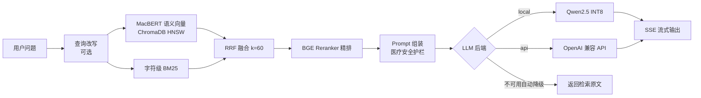

# 康语 · 医疗健康知识智能问答系统


基于 **RAG（检索增强生成）** 架构的医疗健康与养生知识问答系统。面向普通大众，帮助大家在日常生活中更好地了解健康养生与基础医学常识，支持混合检索、流式输出、多轮对话。

> ⚠️ **健康声明**：本系统提供的内容仅为**健康科普与养生知识参考**，**不构成医疗诊断、治疗建议或处方**，也**不能替代执业医师的面诊**。涉及具体病情、用药、剂量、孕期/婴幼儿/慢病等个体情况，请前往正规医疗机构就诊或咨询医生、药师。如出现急症（剧烈胸痛、呼吸困难、意识障碍、大出血、疑似中风/心梗等），请立即拨打 **120** 急救。

## 架构概览



```
用户问题 → 查询改写(可选) → 混合检索(语义+BM25) → RRF融合 → BGE Reranker精排 → LLM生成 → 流式输出
```

## 核心特性

| 特性 | 说明 |
|---|---|
| 混合检索 | MacBERT 语义向量 + 字符级 BM25 双路召回，RRF(k=60) 融合，BGE CrossEncoder 门控精排（高置信精确命中直通） |
| 双 LLM 后端 | 本地 Qwen2.5-1.5B INT8 量化推理 / 远程 OpenAI 兼容 API（SiliconFlow、DeepSeek、百炼等），运行时热切换 |
| 三级降级 | RAG 生成 → 检索返回原文 → 兜底话术，LLM 不可用时服务不中断 |
| 多轮对话 | 会话 TTL 过期回收 + 线程锁；查询改写消除指代歧义（可选） |
| 流式输出 | SSE token 级推送，类 ChatGPT 打字机体验 |
| 医疗安全护栏 | Prompt 层不诊断、不替代就医、急症引导 120、用药遵医嘱；前端常驻免责声明 |
| 知识库 | 5,915 条医疗问答 / 23 个主题（内科、外科、妇产、儿科、肿瘤、心理、中医养生等） |
| 可观测 | Loguru 结构化日志、用户反馈 JSONL 持久化与统计 |
| 工程质量 | pytest 92 条测试（43 单测 + 49 集成）、GitHub Actions CI、Docker 多阶段非 root 构建 + 健康检查 |

## 检索质量评测

`evaluation/retrieval_eval.py` 对知识库做抽样 holdout 评测（gold 保留在库内，衡量"给定问题能否把标准答案排进最前列"）：

- **full_q**：用完整问题检索（问答路由准确率）
- **partial_q**：仅用问题前 15 字检索（模拟用户不完整输入，更接近真实场景）

| 查询模式 | 检索配置 | Hit@1 | Recall@5 | MRR@10 |
|---|---|---:|---:|---:|
| full_q（完整问题） | 仅语义向量 | 0.990 | 1.000 | 0.994 |
| full_q | 混合检索 + RRF | 0.995 | 1.000 | 0.998 |
| full_q | 混合 + 门控精排（当前线上配置） | **0.995** | 1.000 | **0.998** |
| partial_q（前 15 字） | 仅语义向量 | 0.220 | 0.335 | 0.270 |
| partial_q | 混合检索 + RRF | 0.370 | 0.970 | 0.645 |
| partial_q | 混合 + 门控精排（当前线上配置） | **0.955** | **0.970** | **0.963** |

**评测驱动的两个关键结论**：
1. 真实用户常输入不完整问题（partial_q），纯语义检索在此场景几乎不可用（Hit@1 仅 0.22），混合召回 + 精排是必需的；
2. 初版精排以"长答案原文"打分且无条件执行，导致精确匹配场景 Hit@1 从 0.995 劣化到 0.740 —— 修复为**问题文本对齐打分 + 语义置信度 ≥0.98 直通**后，两种场景同时达到最优。

> 复现命令：`python evaluation/retrieval_eval.py --sample 200 --seed 42`，报告输出至 `evaluation/results/retrieval_eval.json`。

## 项目结构

```
├── app.py                 # FastAPI 主入口 + API 路由
├── config.py              # 集中配置管理（环境变量可覆盖）
├── rag_engine.py          # RAG 引擎（检索 + 生成编排, Protocol 解耦 LLM 后端）
├── llm_engine.py          # 本地 LLM 推理引擎（transformers, INT8）
├── api_llm.py             # 远程 API LLM 引擎（OpenAI 兼容）
├── conversation.py        # 多轮对话会话管理（TTL + 线程锁）
├── feedback.py            # 用户反馈收集（JSONL）
├── prompts.py             # 健康助手提示词 + 医疗安全护栏
├── train.py               # MacBERT 微调脚本（可选，提升检索效果）
├── build_kb.py            # 健康知识库构建脚本（生成向量与问答库）
├── retriever/             # 混合检索: 向量存储 / BM25 / RRF+Rerank
├── evaluation/            # RAGAS 端到端评估 + 检索质量评测
├── tests/                 # pytest: 单测(快) + integration(加载模型, 慢)
├── templates/             # 前端 SPA（青绿健康主题 + 免责横幅）
├── .github/workflows/     # CI
└── Dockerfile / docker-compose.yml
```

## 快速开始

### 1. 安装依赖

```bash
pip install -r requirements.txt
```

### 2. 配置环境变量

```bash
cp .env.example .env
# 编辑 .env 配置文件
```

### 3. 准备健康知识库

知识库源数据为 `data/Health-QA-Dataset/health_qa.json`（内置 5,915 条、23 个主题的医疗问答）。生成向量与问答库：

```bash
python build_kb.py
# 可选：在健康数据集上微调 MacBERT 以提升检索（需要 GPU 更佳）
# python train.py
```

生成产物位于 `model/health_macbert/`：`qa_library.json` 与 `qa_embeddings.npy`。

### 4. 启动服务

```bash
python app.py
# 访问 http://localhost:5000
# API 文档 http://localhost:5000/docs
```

或使用 Docker：

```bash
docker compose up --build
```

### 5. 运行测试

```bash
pytest -q -m "not integration"   # 快速单测（CI 使用, ~12s）
pytest -q -m integration         # 全链路集成测试（需本地模型权重, 较慢）
```

## 配置说明

| 环境变量 | 默认值 | 说明 |
|---------|--------|------|
| `LLM_BACKEND` | `local` | LLM 后端：`local` / `api` |
| `LLM_MODEL_NAME` | `Qwen/Qwen2.5-1.5B-Instruct` | 本地模型名 |
| `API_BASE_URL` | `https://api.siliconflow.cn/v1` | API 地址 |
| `API_KEY` | - | API 密钥 |
| `API_MODEL` | `Qwen/Qwen2.5-7B-Instruct` | API 模型名 |
| `RAG_MODE` | `auto` | RAG 模式：`rag` / `retrieval` / `auto` |
| `EMBED_MODEL_NAME` | `hfl/chinese-macbert-base` | 嵌入模型 |
| `FINE_TUNED_MODEL_DIR` | `model/health_macbert` | 健康知识库目录（含 qa_library.json） |
| `TOP_K_RETRIEVAL` | `5` | 最终返回数量 |
| `ENABLE_RERANKER` | `true` | 启用 BGE Reranker |
| `DEBUG` | `false` | 调试模式 |

## API 接口

| 方法 | 路径 | 说明 |
|------|------|------|
| GET | `/` | 前端页面 |
| GET | `/api/health` | 健康检查（含模式/设备/知识库规模） |
| POST | `/api/ask` | 同步问答 |
| POST | `/api/ask/stream` | 流式问答（SSE） |
| GET | `/api/sample_questions` | 示例问题 |
| POST | `/api/conversation/new` | 创建会话 |
| POST | `/api/conversation/{id}/clear` | 清除会话 |
| GET | `/api/conversation/{id}` | 获取会话历史 |
| POST | `/api/feedback` | 提交反馈 |
| GET | `/api/feedback/stats` | 反馈统计 |

## 知识库主题分布（5,915 条）

内科常见病 800 ｜ 外科与创伤 800 ｜ 妇产科健康 800 ｜ 皮肤与性病健康 712 ｜ 儿科与儿童保健 657 ｜ 眼耳鼻喉口腔 543 ｜ 肿瘤防治 351 ｜ 心理健康 226 ｜ 中医养生 198 ｜ 传染病预防 193 ｜ 其余 13 类共 635 条

> 内置数据集为**演示用种子知识库**，内容力求准确保守，但**正式上线前应由具备资质的医疗专业人员审核**，并可替换为更权威、更大规模的数据源（如公开医学指南、科普知识库等）。

## 支持的 API 服务商

所有兼容 OpenAI Chat Completions 接口的服务均可使用：

- 硅基流动 `https://api.siliconflow.cn/v1`
- DeepSeek `https://api.deepseek.com/v1`
- 阿里百炼 `https://dashscope.aliyuncs.com/compatible-mode/v1`
- 智谱 AI `https://open.bigmodel.cn/api/paas/v4`
- Groq `https://api.groq.com/openai/v1`

## 关于 AI 辅助开发

本项目采用 **AI 结对编程**工作流（Claude / Codex 等编码助手 + 人工审查）：架构设计、关键路径取舍（RRF vs 加权融合、降级策略、接口协议解耦）、安全护栏规则、测试用例评审与全部缺陷修复由人工主导；样板代码与部分单测由 AI 生成后经人工逐段审查。仓库保留完整提交历史，可追溯每次 AI 产出的人工修正记录。

## 许可证

MIT

